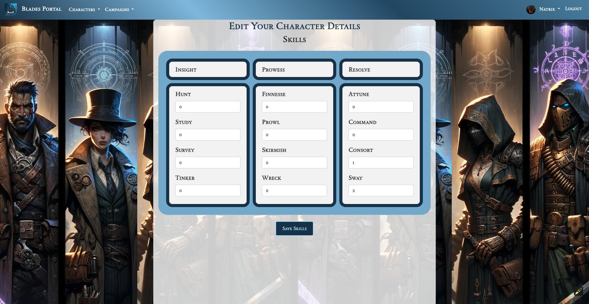
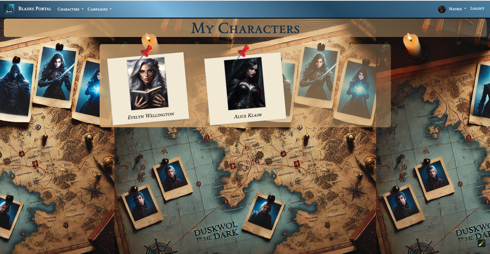

# Blades in the Dark Portal

## Overview
The Blades in the Dark Portal is a web application designed to enhance the gaming experience for players of the "Blades in the Dark" tabletop role-playing game. This portal serves as a comprehensive platform where players can manage their campaigns, create and edit characters, and organize gameplay sessions.

## Tech Stack
- **Backend:** Python/Flask, SQLAlchemy, PostgreSQL, WTForms
- **Frontend:** HTML, CSS, JavaScript, Bootstrap, Jinja
- **Deployment:** Heroku
- **APIs:** Custom Blades in the Dark API

## Project Goal
The goal of the Blades in the Dark Portal is to provide a centralized hub for players to manage their games and characters, facilitating a more immersive and organized gameplay tracking system.

## Target Users
The target demographic includes:
- Individuals who play Blades in the Dark and need a more effective way to keep track of their games.
- Players eager to bring new ideas and campaigns to life.

## Data Collection
The Blades in the Dark API provides the necessary functionality to create the website. User data will be collected during registration (email/password) with hashing for security. Additional data will be collected through site features such as making campaigns, creating/editing user profiles, character profiles, and admin access functionalities.

## Project Breakdown
### Design Database Schema
- Determine the models and database schema required for the project.

### Source Data
- Utilize the custom Blades in the Dark API.
- https://blades-portal-api.surganov.dev/
- https://blades-portal-api.surganov.dev/swagger/index.html

### User Flows
- Design user flows to ensure a smooth user experience as they navigate the site.

### Set Up Backend and Database
- Configure environmental variables and set up the database.

### Set Up Frontend
- Link the frontend framework to the backend with API calls.

### User Authentication
- Implement login and sign-up functionalities.

### Forms
- Create forms for sign-in, login, character management, campaign management, crew management, profile editing, and session history.

### Models
- Set up models for User, Session, Campaign, Character, and Cohort in `models.py`.

### Full-Stack Features
- **User Authentication & Authorization:** Implement login/sign-in features.
- **Character Management:** Allow users to add, edit, and delete characters.
- **Campaign Management:** Enable users to add, edit, and delete campaigns.
- **Crew Management:** Allow users to add, edit, and delete a crew in campaigns.
- **Cohort Management:** Enable users to add, edit, and delete cohorts.
- **Session Posts:** Allow users to create and edit posts for game sessions.
- **Relationship Logic in UI:** Visualize relationships between users, campaigns, characters, cohorts, sessions, and crew.
- **Campaign List Management:** Allow users to filter and view the list of campaigns they own.

## Website Features and Priorities
- **Auth&**
 Welcome Page.
  
- **Character Management:**
  - Create characters using an AI image generator or by adding an image URL.
  
  - Choose abilities of your character.
  
  - Character main page.
  
  

  - Edit character skills, abilities, and stress/trauma progress bars in different forms.
    
  - Delete characters.
  - View a list of your characters.
   

- **Campaign Management:**
  - Create  campaigns.
  
  -  View a list of your campaigns.
  
  - Edit or delete campaigns.
  - Main page of your campaign..
  
  -Shortcut to the characters description. 
  

- **Session Management:**
  - Create sessions for campaigns that you own.
    
  - Edit or delete sessions.

- **Participation in Campaigns:**
  - Join and be a part of other campaigns.
    
  - Manage your participation in multiple campaigns.
    
  - Have multiple characters participate in the same campaign.
  - Leave campaigns at any time.

## Final Product
The Blades in the Dark Portal will offer a rich and engaging platform for players to manage their Blades in the Dark games, providing tools and features that support a seamless and organized gaming experience.
