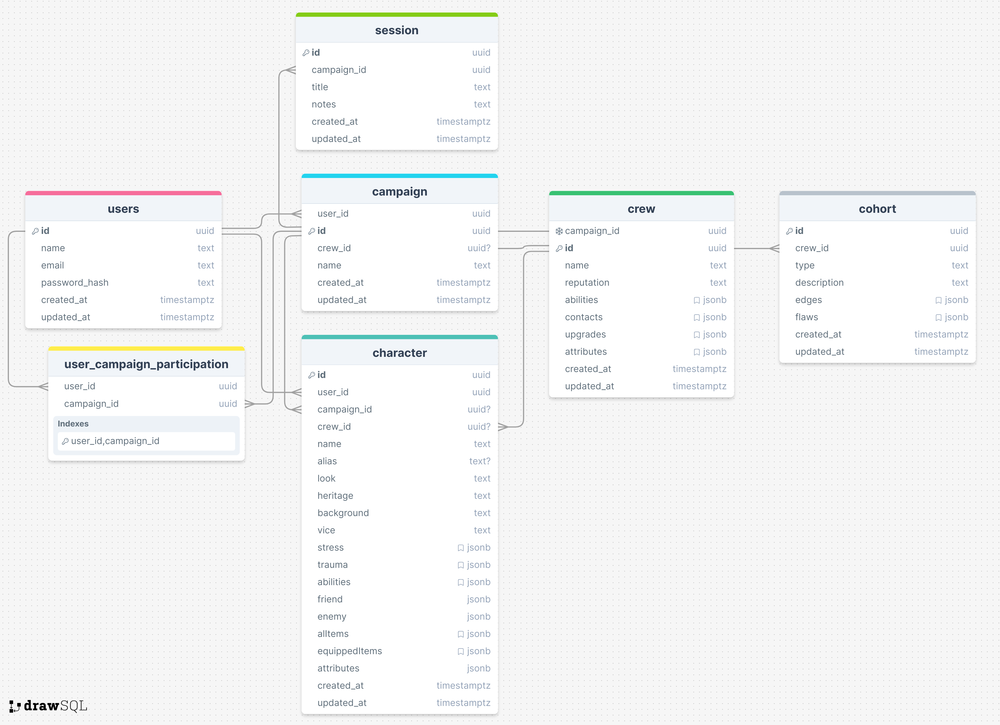

# Blades in the Dark Portal
### Author: Daria Zelenska
### Springboard Software Engineering Career Track
### Capstone 1: Project Proposal

# Project Proposal

|            | Description                                                                                                                                                                                                                                                                                                                                              | Fill in                                                                                                                                                                                                                                                                                                                                                                                                                                                 |
|------------|----------------------------------------------------------------------------------------------------------------------------------------------------------------------------------------------------------------------------------------------------------------------------------------------------------------------------------------------------------|---------------------------------------------------------------------------------------------------------------------------------------------------------------------------------------------------------------------------------------------------------------------------------------------------------------------------------------------------------------------------------------------------------------------------------------------------------|
| Tech Stack | What tech stack will you use for your final project? It is recommended to use the following technologies in this project: Python/Flask, PostgreSQL, SQLAlchemy, Heroku, Jinja, RESTful APIs, JavaScript, HTML, CSS. Depending on your idea, you might end up using WTForms and other technologies discussed in the course.                               | Python/Flask, SQLAlchemy, PostgreSQL, WTForms, JavaScript, HTML, CSS, Bootstrap, Jinja, Blades Portal API                                                                                                                                                                                                                                                                                                                                               |
| Type       | Will this be a website? A mobile app? Something else?                                                                                                                                                                                                                                                                                                    | Website                                                                                                                                                                                                                                                                                                                                                                                                                                                 |
| Goal       | What goal will your project be designed to achieve?                                                                                                                                                                                                                                                                                                      | I want to build this Blades In the Dark website using my own API to provide a comprehensive  platform for players to enhance their gaming experience. The website will  serve  as  a  centralized  hub  where  players  can  manage  their  games(campaigns),  creates and edit characters, facilitating  a  more  immersive  and  organized  gameplay  tracking system.                                                                                |
| Users      | What kind of users will visit your app? In other words, what is the demographic of your users?                                                                                                                                                                                                                                                           | The target demographic includes individuals who play Blades in the Dark and need a more effective way to keep track of their games, as well as those who are eager to bring new ideas and campaigns to life.                                                                                                                                                                                                                                            |
| Data       | What data do you plan on using? How are you planning on collecting your data? You may have not picked your actual API yet, which is fine, just outline what kind of data you would like it to contain. You are welcome to create your own API and populate it with data. If you are using a Python/Flask stack, you are required to create your own API. | The [Blades in the Dark API Spec](https://blades-portal-api.surganov.dev)  has all functionality that I need to create the website. User data for my database will be collected on registration (email/password) with using hashing and through use of features in the site (making campaigns, creating/editing user profile and characters profiles, admin access with the abilities: remove/add new players to the campaign, makeing new info posts). |

# Project Breakdown
| Task Name                            | Description                                                                                                                                                                                                  | Example                                                           |
|--------------------------------------|--------------------------------------------------------------------------------------------------------------------------------------------------------------------------------------------------------------|-------------------------------------------------------------------|
| Design Database schema               | Determine the models and database schema required for your project.                                                                                                                                          | [Schema](#database-schema)                                        |
| Source Data                          | Determine where your data will come from. You may choose to use an existing API or create your own.                                                                                                          | [API](https://blades-portal-api.surganov.dev)                     |
| User Flows                           | Determine user flow(s) - think about what you want a user’s experience to be like as they navigate your site.                                                                                                | [Flows](#app-flow)                                                |
| Set up backend and database          | Configure the environmental variables on your framework of choice for development and set up the database.                                                                                                   | Backend                                                           |
| Set up frontend                      | Set up frontend framework of choice and link it to the backend with a simple API call for example.                                                                                                           | Frontend, Medium, Must Have                                       |
| User Authentication                  | Full-stack feature - ability to authenticate (login and sign up) as a user.                                                                                                                                  | Full-stack feature, Easy, Must Have                               |
| Set up forms                         | Set up sign-in form, login form, character forms (create, edit), campaign form (join campaign, create/edit), crew form (create, edit), profile forms (edit). Set up Session History - new/edit session form. | Full-stack feature, Easy, Must Have                               |
| Set up User model                    | Set up models.py with User model and corresponding table in database.                                                                                                                                        | [Link](https://github.com/hatchways/sb-capstone-example/issues/4) |
| Set up Session model                 | Set up models.py with Session model and corresponding table in database.                                                                                                                                     | Backend, Easy, Must Have                                          |
| Set up Campaign model                | Set up models.py with Campaign model and corresponding table in database.                                                                                                                                    | Backend, Easy, Must Have                                          |
| Set up Character model               | Set up models.py with Character model and corresponding table in database.                                                                                                                                   | Backend, Easy, Must Have                                          |
| Set up Cohort model                  | Set up models.py with Cohort model and corresponding table in database.                                                                                                                                      | Backend, Easy, Must Have                                          |
| User Authentication & Authorization  | Ability to authenticate (login/sign in).                                                                                                                                                                     | Full-stack feature, Medium, Must Have                             |
| Add Characters                       | Full-stack feature that allows users to add characters to the database and their personal character page, with options to edit and delete characters.                                                        | Full-stack feature, Medium, Must Have                             |
| Add Campaigns                        | A full-stack feature enabling users to add campaigns to the database and their personal campaigns page, with capabilities to edit and delete campaigns.                                                      | Full-stack feature, Medium, Must Have                             |
| Add Crew in Campaign                 | A full-stack feature enabling users to add a crew (limit 1) to the database and their personal campaign page with options to edit and delete crew.                                                           | Full-stack feature, Medium, Must Have                             |
| Add Cohorts                          | A full-stack feature that allows users to add cohorts to the database and their personal cohort page, with options to edit and delete cohorts.                                                               | Full-stack feature, Medium, Must Have                             |
| Add Posts to a Sessions              | A full-stack feature allowing users to create and edit posts for game sessions.                                                                                                                              | Full-stack feature, Medium, Must Have                             |
| Add Relationship Logic in UI         | Visualize the relationship logic between users/campaigns/characters/cohorts/session/crew.                                                                                                                    | Full-stack feature, Medium, Must Have                             |
| Making and editing list of campaigns | Full-stack feature that allows users to see and filter the list of campaigns that the current user owns.                                                                                                     | Full-stack feature, Medium, Must Have                             |

# App Flow

# Database Schema

